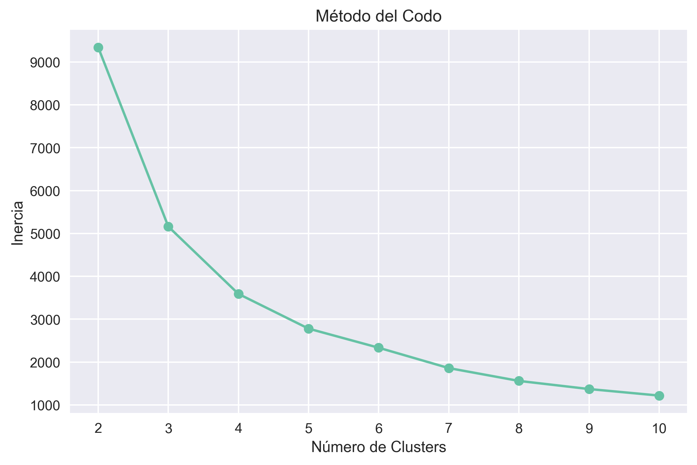
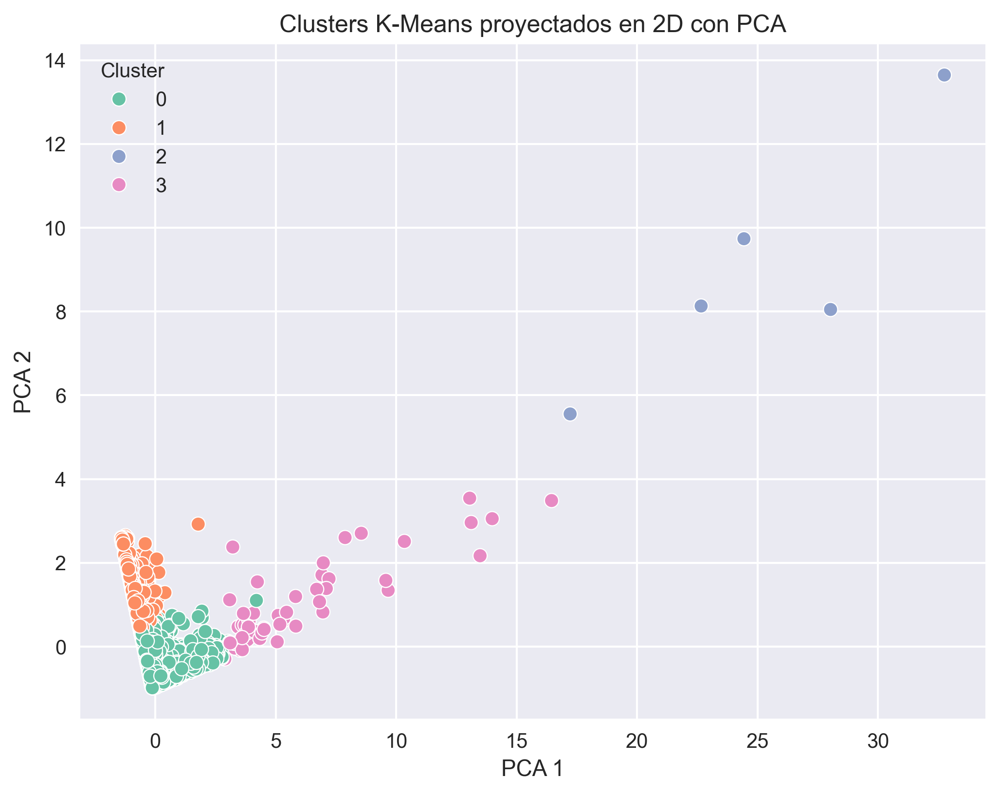
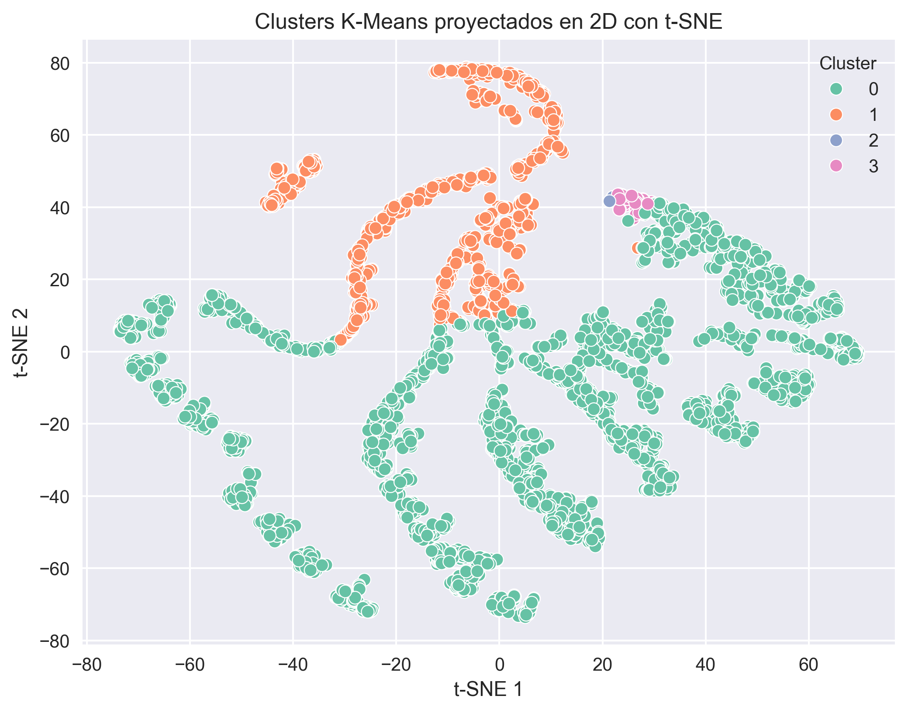

## Resultados del Clustering (K-Means)

Después de aplicar el modelo K-Means sobre las variables RFM (Recency, Frequency y Monetary), se identificaron cuatro segmentos principales de clientes.

### Distribución de Clusters

- **Cluster 0:** 3207 clientes  
- **Cluster 1:** 1049 clientes  
- **Cluster 2:** 5 clientes  
- **Cluster 3:** 53 clientes  

La segmentación muestra una estructura clara entre clientes activos, inactivos y clientes de alto valor.

---

### Perfil Promedio por Cluster

#### Cluster 0 – Clientes Activos de Valor Medio-Alto
- Recency ≈ 43 días  
- Frequency ≈ 4.47 compras  
- Monetary ≈ 1743  

Este grupo representa clientes que compran con relativa frecuencia y mantienen un nivel de gasto superior al promedio. Son clientes activos estratégicamente importantes para programas de fidelización.

---

#### Cluster 1 – Clientes Inactivos o de Bajo Valor
- Recency ≈ 243 días  
- Frequency ≈ 1.65 compras  
- Monetary ≈ 595  

Estos clientes presentan baja frecuencia y alto tiempo desde su última compra. Representan una oportunidad para campañas de reactivación.

---

#### Cluster 2 – Clientes VIP Extremos
- Recency ≈ 5 días  
- Frequency ≈ 113 compras  
- Monetary ≈ 215,543  

Se trata de un grupo muy pequeño pero con un impacto financiero extremadamente alto. Son clientes mayoristas o de comportamiento excepcional. Representan el segmento más rentable.

---

#### Cluster 3 – Clientes Premium
- Recency ≈ 15 días  
- Frequency ≈ 48 compras  
- Monetary ≈ 29,040  

Clientes con alta frecuencia y gasto elevado. Constituyen un segmento estratégico que puede beneficiarse de programas exclusivos o beneficios personalizados.

---

### Conclusiones del Modelo

El modelo K-Means logró identificar segmentos diferenciados en función del comportamiento de compra. Se observa una clara separación entre clientes inactivos, clientes regulares y clientes de alto valor.

Asimismo, la presencia de clusters pequeños con alto gasto indica la existencia de outliers positivos que representan una parte significativa de los ingresos.

Esta segmentación permite diseñar estrategias específicas para cada grupo, optimizando acciones de marketing y fidelización.

## Visualizaciones

### Método del Codo

### Proyección PCA

### Proyección t-SNE

